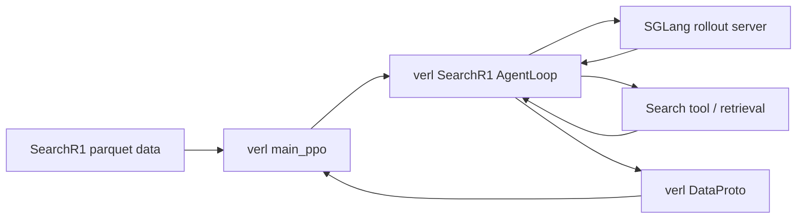
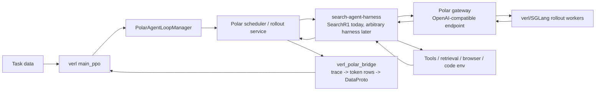

# blackbox-search-agent-rl

`blackbox-search-agent-rl` is a research repo for RL training of **black-box search
agents**.  The goal is to let verl train on trajectories produced by any
`search-agent-harness` instead of hard-coding one particular agent loop inside the
trainer.  This checkout currently ports the verl standalone SearchR1 flow into a
Polar-backed, harness-driven architecture while keeping verl and ProRL-Agent-Server
pinned as reproducible submodules.

## Pinned upstreams

- `submodules/prorl-agent-server`: `NVIDIA-NeMo/ProRL-Agent-Server` at
  `ce92702f65c1ba454ce16b341db4ae9463156719`
- `submodules/verl`: `verl-project/verl` at
  `6dc2d2301e046006001dfdfbfb5f4666a1cf4ad1`

Initialize them with:

```bash
git submodule update --init --recursive
```

Local changes live in `overlays/prorl-agent-server/` and can be applied with:

```bash
scripts/apply_prorl_overlay.sh
```

## Why this architecture

The original verl standalone SearchR1 setup couples four concerns in one path:
VERL rollout scheduling, SearchR1 prompt/tool logic, model serving, and conversion
back to `DataProto`.  That is useful for one recipe, but it makes it hard to swap
in a different black-box search harness because every harness has different tool
state, callback behavior, request fanout, and intermediate prompt construction.

This repo separates those concerns:

1. **verl remains the RL optimizer**: PPO/GRPO, weight update, logprob recompute,
   and checkpointing stay in verl.
2. **Polar is the rollout/control plane**: it accepts tasks, runs async sessions,
   routes model calls, and records completion traces.
3. **`search-agent-harness` is the replaceable policy environment**: SearchR1 is
   just the first harness.  A future harness only needs to drive the gateway and
   return structured traces/rewards.
4. **The bridge turns arbitrary harness traces into verl rows**: it reconstructs
   token-level prompts/responses, masks non-trainable interstitial tokens, and
   emits fixed `DataProto` batches for verl.

That boundary is what makes “any search-agent-harness” practical: a harness can be
implemented as a black box that talks to an OpenAI-compatible endpoint and tools,
while the bridge handles the trainer-specific details once.

## Architecture difference

### Before: verl standalone SearchR1



Characteristics:

- SearchR1 agent loop is embedded in the verl rollout path.
- Tool calling and multi-turn state are recipe-specific.
- Supporting a new search harness usually means writing another verl-native agent
  loop and re-solving trace-to-`DataProto` alignment.

### After: blackbox-search-agent-rl



Benefits:

- **Harness portability**: the harness owns domain logic; the bridge owns RL data
  formatting.
- **Async fanout**: Polar can run many sessions and return trainable traces when
  ready.
- **Stable trainer interface**: verl receives normal fixed `DataProto` batches.
- **Less train/inference skew**: model calls are made through the same
  OpenAI-compatible pathway a black-box harness uses at inference time.

## Prompt-grounded trajectory merging

A search harness often calls the model multiple times in one episode:

```text
prompt_0 -> assistant_0 -> tool_0 -> prompt_1 -> assistant_1 -> ...
```

verl, however, trains on token rows with prompt tokens, response tokens, response
logprobs, and a loss mask.  The bridge therefore reconstructs one training trace
from many completion records.

The current merge mode is:

```bash
POLAR_PREFIX_MERGING_MODE=prompt_grounded_single
```

The implementation is inspired by the trajectory merging approach used in slime,
but the code and public configuration here use the neutral “prompt-grounded” name.
Concretely:

1. **Group append-only completions** by request/session metadata and strict token
   prefix checks.
2. **Use raw sampled assistant tokens** from each completion as trainable tokens,
   preserving the exact token IDs and logprobs returned by rollout.
3. **Use the next prompt as canonical context** for tool outputs, chat-template
   glue, and intermediate user/tool messages.
4. **Mask copied/interstitial context** with `loss_mask=0` and synthetic logprobs;
   only sampled assistant spans get `loss_mask=1`.
5. **Reset/truncate defensively** if the stitched prefix no longer matches the
   next rollout prompt, instead of silently training on drifted tokens.

### Detailed merge procedure

Each model call is recorded as a completion trace:

```text
completion_i = {
  prompt_ids:        tokens that actually conditioned this rollout call,
  response_ids:      tokens sampled by the model for this call,
  response_logprobs: logprobs for response_ids,
  response_messages: assistant/tool-call messages decoded by the harness,
  metadata:          request id, session id, reward/provenance fields, ...
}
```

The merge builder converts a chain of such completions into one verl training row
with one `prompt_ids` prefix and one `response_ids` stream.  The response stream is
a mixture of trainable sampled assistant spans and non-trainable context spans.
The exact operation is:

1. **Start from the first rollout prompt.**

   ```text
   merged_prompt = completion_0.prompt_ids
   merged_response = []
   loss_mask = []
   logprob_slots = []
   output_spans = []
   ```

2. **Append the current sampled response as a trainable span.**  For completion
   `i`, its `response_ids` are appended directly, without decoding or re-tokenizing:

   ```text
   output_start = len(merged_response)
   merged_response += completion_i.response_ids
   loss_mask       += completion_i.response_loss_mask or 1s
   logprob_slots   += completion_i.response_logprobs
   output_spans.append([output_start, len(merged_response)))
   ```

3. **Before appending the next response, reconcile against the next actual prompt.**
   For completion `i + 1`, the prompt that the model actually saw should be:

   ```text
   completion_{i+1}.prompt_ids
     = merged_prompt + already_accepted_assistant_or_context_tokens + new_context_tail
   ```

   The builder first verifies that `completion_{i+1}.prompt_ids` still starts with
   `merged_prompt`.  If the base prompt changed, it treats this as a new segment:
   reset `merged_prompt` to the current prompt and clear the in-segment response
   stream.  This is safer than silently mixing unrelated prompts into one row.

4. **Find the common prefix between the stitched response stream and the next
   prompt suffix.**

   ```text
   prompt_suffix = completion_{i+1}.prompt_ids[len(merged_prompt):]
   matched_len = longest_common_prefix(merged_response, prompt_suffix)
   ```

   `matched_len` tells us how much of the already-stitched stream is confirmed by
   the next real rollout prompt.  If `matched_len < len(merged_response)`, the
   stitched stream has drifted from the prompt that conditioned the next model
   call.  The builder then truncates `merged_response`, `loss_mask`, and
   `logprob_slots` back to `matched_len`.

5. **If truncation cuts through an old assistant span, mask the retained prefix of
   that partial span.**  A partial assistant span no longer corresponds to a full
   sampled completion, so the retained partial tokens are kept as context but not
   optimized:

   ```text
   loss_mask[partial_output_prefix] = 0
   logprob_slots[partial_output_prefix] = synthetic_zero_logprobs
   ```

6. **Append the canonical context tail from the next prompt.**  The part of the
   next prompt after `matched_len` is the tool output, chat-template glue, user
   message, or other harness context that was present during rollout but was not
   sampled by the policy in the previous step:

   ```text
   context_tail = prompt_suffix[matched_len:]
   merged_response += context_tail
   loss_mask       += 0s
   logprob_slots   += synthetic_zero_logprobs
   ```

7. **Append the next sampled response with real logprobs**, then repeat the same
   reconciliation process for the following completion.

A small example:

```text
completion_0.prompt_ids   = P0
completion_0.response_ids = A0_raw

completion_1.prompt_ids   = P0 + A0_canonical_prefix + TOOL0 + USER1
completion_1.response_ids = A1_raw
```

The merged row becomes:

```text
prompt_ids    = P0
response_ids  = A0_raw_confirmed + TOOL0 + USER1 + A1_raw
loss_mask     = 1s for confirmed sampled assistant tokens
                0s for TOOL0 / USER1 / copied context
                1s for A1_raw
logprobs      = real rollout logprobs on sampled assistant spans
                synthetic zero logprobs on masked context spans
```

The important detail is that `TOOL0 + USER1` comes from
`completion_1.prompt_ids`, i.e. the canonical prompt that actually conditioned the
next rollout call.  It is not reconstructed from a separately decoded transcript.

This helps avoid train/inference inconsistency: the next model call during rollout
conditions on the harness-rendered prompt, and the training row is stitched back to
that same prompt boundary rather than a separately decoded/re-encoded transcript.
Sampled assistant tokens keep their rollout token IDs/logprobs, while tool outputs
and prompt glue are retained only as masked context.

## Running the current true-long SearchR1 training

This overlay keeps the minimal SearchR1 + Polar + VERL path for a Qwen-family
policy model using `POLAR_PREFIX_MERGING_MODE=prompt_grounded_single` and fixed DataProto
fanout training. Packed-variable, variable-training, and alignment/outlier debug
patch paths are intentionally removed from the long-run command.

All cluster-specific paths below are placeholders. Replace them with your own
model, dataset, retrieval, and SearchR1 baseline file locations.

### Current true-long command

```bash
ray stop --force || true

lsof -ti tcp:30000 2>/dev/null | xargs -r kill -9 || true
lsof -ti tcp:1249 2>/dev/null | xargs -r kill -9 || true
lsof -ti tcp:18080 2>/dev/null | xargs -r kill -9 || true
lsof -ti tcp:18100 2>/dev/null | xargs -r kill -9 || true

pkill -f "main_ppo.py" || true
pkill -f "SGLangHttpServer" || true
pkill -f "sglang.srt" || true
pkill -f "sglang.launch_server" || true
pkill -f "retrieval_server_sglang_summarize.py" || true
pkill -f "polar.cli serve_rollout" || true
pkill -f "polar.cli serve_gateway" || true

sleep 10
nvidia-smi

LOG_DIR=logs/search_verl_polar_qwen3_4b_true_long_$(date +%Y%m%d_%H%M%S) \
VERL_ROOT=../verl \
CONFIG_PATH=/path/to/search/config \
CONFIG_NAME=search_multiturn_grpo \
MODEL_PATH=/path/to/policy/model \
POLAR_ROLLOUT_IS_TOKENIZER_PATH=/path/to/policy/model \
RAW_TRAIN_DATA=/path/to/train.parquet \
PREPARE_LONG_DATA=1 \
TOOL_CONFIG=/path/to/search/config/tool_config/search_tool_config.yaml \
POLAR_SEARCH_TOOL_CONFIG_PATH=/path/to/search/config/tool_config/search_tool_config.yaml \
STANDALONE_TOOL_CONFIG_PATH=/path/to/search/config/tool_config/search_tool_config.yaml \
SUMMARY_MODEL_PATH=/path/to/summary/model \
RETRIEVAL_INDEX_PATH=/path/to/retrieval/index.faiss \
RETRIEVAL_CORPUS_PATH=/path/to/retrieval/corpus.jsonl \
RETRIEVER_MODEL_PATH=/path/to/retriever/model \
RETRIEVAL_SERVER_SCRIPT=/path/to/retrieval_server_sglang_summarize.py \
BASELINE_TOOL_PARSER_SRC=/path/to/search_baseline/tool_parser.py \
BASELINE_SEARCH_TOOL_SRC=/path/to/search_baseline/search_tool.py \
BASELINE_SEARCH_UTILS_SRC=/path/to/search_baseline/search_r1_like_utils.py \
BASELINE_REWARD_SCORE_SRC=/path/to/search_baseline/search_r1_like_qa_em.py \
BASELINE_REWARD_INIT_SRC=/path/to/search_baseline/__init__.py \
SUMMARY_SGLANG_CUDA_VISIBLE_DEVICES=1 \
RETRIEVAL_CUDA_VISIBLE_DEVICES=0,1,2,3 \
TRAIN_CUDA_VISIBLE_DEVICES=4,5,6,7 \
CUDA_VISIBLE_DEVICES=4,5,6,7 \
START_SUMMARY_SGLANG=1 \
START_RETRIEVAL_SERVER=1 \
START_POLAR_SERVICES=1 \
RESTART_POLAR_SERVICES=1 \
RESTART_POLAR_GATEWAY=1 \
RESTART_POLAR_ROLLOUT=1 \
INSTALL_DEPS=1 \
APPLY_VERL_PATCH=1 \
APPLY_SEARCH_BASELINE_PATCHES=1 \
POLAR_N_GPUS_PER_NODE=4 \
POLAR_ROLLOUT_TP_SIZE=1 \
POLAR_ROLLOUT_DP_SIZE=1 \
POLAR_TRAIN_BATCH_SIZE=128 \
POLAR_VAL_BATCH_SIZE=256 \
POLAR_PPO_MINI_BATCH_SIZE=32 \
POLAR_PPO_MICRO_BATCH_SIZE_PER_GPU=1 \
POLAR_AGENT_NUM_WORKERS=128 \
POLAR_ROLLOUT_N=8 \
POLAR_TOTAL_EPOCHS=20 \
POLAR_TOTAL_TRAINING_STEPS=null \
POLAR_DATA_SHUFFLE=true \
POLAR_DATA_SEED=2026 \
POLAR_MAX_PROMPT_LENGTH=4096 \
POLAR_MAX_RESPONSE_LENGTH=35000 \
POLAR_FILTER_OVERLONG_PROMPTS=True \
POLAR_DATA_TRUNCATION=error \
POLAR_ROLLOUT_MAX_MODEL_LEN=40000 \
SEARCH_MAX_MODEL_LEN=40000 \
POLAR_ROLLOUT_GPU_MEMORY_UTILIZATION=0.5 \
POLAR_ROLLOUT_TEMPERATURE=1.0 \
POLAR_ROLLOUT_TOP_P=1.0 \
POLAR_ROLLOUT_TOP_K=-1 \
POLAR_ROLLOUT_REPETITION_PENALTY=1.0 \
POLAR_ROLLOUT_DO_SAMPLE=true \
SEARCH_TEMPERATURE=1.0 \
SEARCH_TOP_P=1.0 \
SEARCH_TOP_K=-1 \
SEARCH_REPETITION_PENALTY=1.0 \
SEARCH_DO_SAMPLE=true \
SEARCH_MAX_TURNS=100 \
SEARCH_MAX_TOKENS=35000 \
SEARCH_MAX_TOOL_RESPONSE_LENGTH=2048 \
SEARCH_TOOL_RESPONSE_TRUNCATE_SIDE=middle \
SEARCH_RETRIEVAL_TIMEOUT=6000 \
POLAR_FANOUT_TRAINING=1 \
POLAR_MAX_ASYNC_LEVEL=2 \
POLAR_MAX_CONCURRENCY=256 \
POLAR_MAX_SESSION_CONCURRENCY=2048 \
POLAR_REQUEST_TIMEOUT=3600 \
POLAR_SGLANG_GENERATE_TIMEOUT=3600 \
POLAR_OVERFLOW_POLICY=verl_truncate \
POLAR_DYNAMIC_HISTORY_ENABLE=true \
POLAR_DYNAMIC_HISTORY_MODE=trace \
POLAR_STITCH_TRACES=true \
POLAR_REJECT_LOGPROB_ERROR=true \
POLAR_SEARCH_BRIDGE_MAX_TOKENS=true \
POLAR_PREFIX_MERGING_MODE=prompt_grounded_single \
POLAR_SAVE_FREQ=-1 \
POLAR_TEST_FREQ=-1 \
POLAR_LOG_LONGEST_TRACE_ARTIFACT=true \
POLAR_LONGEST_TRACE_INTERVAL=10 \
POLAR_PROJECT_NAME=search_r1_like_async_rl \
POLAR_EXPERIMENT_NAME=qwen3-4b-true-long \
POLAR_DEFAULT_LOCAL_DIR=checkpoints/search_verl_polar/qwen3_4b_true_long \
POLAR_RESUME_MODE=disable \
POLAR_TRAINER_METRICS_DEBUG=1 \
POLAR_MANAGER_METRICS_DEBUG=1 \
RAY_DEDUP_LOGS=0 \
HYDRA_FULL_ERROR=1 \
PYTHONUNBUFFERED=1 \
nohup examples/search_verl_polar/launch_polar_long.sh >train.out &
```

### Notes

- `POLAR_PREFIX_MERGING_MODE=prompt_grounded_single` selects the prompt-grounded single-trajectory merge builder.
- `VERL_ROOT` points directly to the pinned verl checkout; no nested verl checkout is required.
- `POLAR_FANOUT_TRAINING=1` keeps Polar dynamic-history/fanout rows in the fixed DataProto PPO update path.
- `POLAR_SAVE_FREQ=-1` and `POLAR_TEST_FREQ=-1` disable periodic checkpoint/eval during this long run.
- Trainer row alignment uses the original VERL row uid in `gen_batch_output.non_tensor_batch["source_uid"]`; dataset/provenance source ids remain in `polar_metadata` only.
