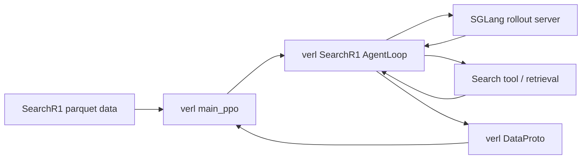
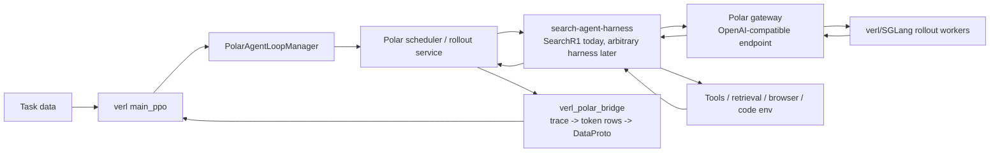

# blackbox-search-agent-rl

`blackbox-search-agent-rl` is a research repo for RL training of **black-box search
agents**.  The goal is to let verl train on trajectories produced by an external
`search-agent-harness`, instead of hard-coding one particular agent loop inside
the trainer.

The current checkpoint of this repo ports the verl standalone SearchR1 flow into
a **Polar + search-agent-harness + verl bridge** architecture.  SearchR1 is the
first harness; the longer-term goal is to support arbitrary search-agent harnesses
that call an OpenAI-compatible endpoint and return structured traces/rewards.

## Repository layout

```text
blackbox-search-agent-rl/
├── .gitmodules
├── README.md
├── scripts/
│   └── apply_prorl_overlay.sh              # copy this repo's overlay into ProRL
├── overlays/
│   └── prorl-agent-server/                 # repo-owned modifications
│       ├── examples/search_verl_polar/     # launch/train scripts for this recipe
│       ├── scripts/patch/                  # patch applied to pinned verl
│       └── src/verl_polar_bridge/          # harness -> verl DataProto bridge
└── submodules/
    ├── prorl-agent-server/                 # pinned ProRL-Agent-Server checkout
    └── verl/                               # pinned verl checkout
```

Pinned upstreams:

- `submodules/prorl-agent-server`: `NVIDIA-NeMo/ProRL-Agent-Server` at
  `ce92702f65c1ba454ce16b341db4ae9463156719`
- `submodules/verl`: `verl-project/verl` at
  `6dc2d2301e046006001dfdfbfb5f4666a1cf4ad1`

The overlay is not used in-place.  It must first be copied into the ProRL
submodule.  After that, all training commands are run from:

```text
submodules/prorl-agent-server
```

From that directory, the pinned verl checkout is the sibling path:

```text
../verl
```

There is no extra nested verl checkout in this repo.

---

## Step-by-step runbook

This section is the operational path from a fresh clone to launching the current
SearchR1 true-long style run.  Commands are written relative to the actual repo
layout above.

The repo does **not** ship model weights, train/val parquet files, retrieval
indexes, or a search corpus.  Replace every `/path/to/...` placeholder with your
own assets.

### 0. Clone and initialize submodules

```bash
git clone --recurse-submodules https://github.com/siqi654321/blackbox-search-agent-rl.git
cd blackbox-search-agent-rl

# Safe to rerun; required if the clone was not recursive.
git submodule update --init --recursive

git submodule status
```

Expected directories after this step:

```text
submodules/prorl-agent-server
submodules/verl
```

### 1. Apply this repo's overlay to ProRL-Agent-Server

From the repo root:

```bash
scripts/apply_prorl_overlay.sh
```

This copies:

```text
overlays/prorl-agent-server/*
```

into:

```text
submodules/prorl-agent-server/*
```

After applying the overlay, these files should exist:

```bash
test -f submodules/prorl-agent-server/examples/search_verl_polar/launch_polar_long.sh
test -f submodules/prorl-agent-server/examples/search_verl_polar/train_polar_long.sh
test -f submodules/prorl-agent-server/scripts/patch/patch_verl.sh
test -d submodules/prorl-agent-server/src/verl_polar_bridge
```

### 2. Enter the applied ProRL checkout

Most scripts below assume this working directory:

```bash
REPO_ROOT="$(git rev-parse --show-toplevel)"
PRO_RL_ROOT="$REPO_ROOT/submodules/prorl-agent-server"
VERL_ROOT="$REPO_ROOT/submodules/verl"

cd "$PRO_RL_ROOT"
```

Use absolute `VERL_ROOT` in environment variables to avoid ambiguity:

```bash
export VERL_ROOT="$VERL_ROOT"
```

### 3. Install runtime dependencies

Use an environment that can already run verl + SGLang training.  The launcher can
install the minimal Polar-side extras with `INSTALL_DEPS=1`, but a fresh machine
still needs the normal CUDA/PyTorch/verl/SGLang stack.

A typical setup is:

```bash
# From submodules/prorl-agent-server
python3 -m pip install -e .
python3 -m pip install -e "$VERL_ROOT"
python3 -m pip install faiss-gpu-cu12==1.8.0 fastapi uvicorn numpy==1.26.4
```

If your cluster image already has these packages, you can skip installation during
launch with:

```bash
export INSTALL_DEPS=0
```

### 4. Patch the pinned verl checkout

There are two patch layers:

1. **Required verl trainer patch**: enables Polar dynamic-history/fanout rows,
   rollout metrics, `source_uid` alignment, and weight-update hooks.
2. **Optional SearchR1 baseline overrides**: copies external SearchR1-compatible
   tool/reward files into the verl checkout for exact standalone comparison.

The required patch can be applied explicitly:

```bash
# From submodules/prorl-agent-server
scripts/patch/patch_verl.sh "$VERL_ROOT"
```

The launcher also runs this automatically when:

```bash
APPLY_VERL_PATCH=1
```

To verify the required patch landed:

```bash
grep -n "_verl_polar_prepare_fanout_training_batch" \
  "$VERL_ROOT/verl/trainer/ppo/ray_trainer.py"
```

For the optional SearchR1 baseline copy step:

- If you have external baseline files, set the `BASELINE_*_SRC` variables and
  keep `APPLY_SEARCH_BASELINE_PATCHES=1`.
- If you want to use the SearchR1-like files already present in the pinned verl
  checkout, set:

```bash
export APPLY_SEARCH_BASELINE_PATCHES=0
```

The required `patch_verl.sh` step is independent of these optional baseline file
copies.

### 5. Choose retrieval setup

The harness needs a retrieval HTTP endpoint.  Pick one of the following two modes.

#### Option A: use the retrieval server shipped in the pinned verl checkout

This is the repo-local path.  It does **not** require an external summarizing
retrieval script.  The pinned verl retriever script hard-codes port `8000`, so
this option is best for a simple single-retriever setup.

Start the retriever manually:

```bash
# Still from submodules/prorl-agent-server
mkdir -p logs/manual_services

CUDA_VISIBLE_DEVICES=0 nohup python3 \
  "$VERL_ROOT/examples/sglang_multiturn/search_r1_like/local_dense_retriever/retrieval_server.py" \
  --index_path /path/to/retrieval/index.faiss \
  --corpus_path /path/to/retrieval/corpus.jsonl \
  --retriever_name e5 \
  --retriever_model /path/to/retriever/model \
  --faiss_gpu \
  > logs/manual_services/retrieval.out 2>&1 &
```

That server listens on `http://127.0.0.1:8000/retrieve`, so launch training with:

```bash
export START_SUMMARY_SGLANG=0
export START_RETRIEVAL_SERVER=0
export SEARCH_RETRIEVAL_URL=http://127.0.0.1:8000/retrieve
export SEARCH_RETRIEVAL_PATH=retrieve
```

#### Option B: use an external summarizing retrieval server

The one-shot launcher can start a summarizing retrieval stack, but that script is
not included in this repo.  Use this mode only if you have a compatible script
that accepts the arguments used by `launch_polar_long.sh`, including:

```text
--index_path
--corpus_path
--faiss_gpu
--retriever_name
--retriever_model
--sglang_base_url
--sglang_model
--host
--port
```

Then set:

```bash
export START_SUMMARY_SGLANG=1
export START_RETRIEVAL_SERVER=1
export SUMMARY_MODEL_PATH=/path/to/summary/model
export RETRIEVAL_SERVER_SCRIPT=/path/to/retrieval_server_sglang_summarize.py
export RETRIEVAL_INDEX_PATH=/path/to/retrieval/index.faiss
export RETRIEVAL_CORPUS_PATH=/path/to/retrieval/corpus.jsonl
export RETRIEVER_MODEL_PATH=/path/to/retriever/model
export SEARCH_RETRIEVAL_URL=http://127.0.0.1:1249/retrieve_summarize_compat
```

### 6. Prepare model, data, and config variables

The current scripts are designed to run from `submodules/prorl-agent-server`.
The following template uses the config and tool config from the pinned verl
submodule, and writes logs/checkpoints under the applied ProRL checkout.

```bash
# From submodules/prorl-agent-server
export CONFIG_PATH="$VERL_ROOT/examples/sglang_multiturn/config"
export CONFIG_NAME=search_multiturn_grpo
export TOOL_CONFIG="$VERL_ROOT/examples/sglang_multiturn/config/tool_config/search_tool_config.yaml"
export POLAR_SEARCH_TOOL_CONFIG_PATH="$TOOL_CONFIG"
export STANDALONE_TOOL_CONFIG_PATH="$TOOL_CONFIG"

export MODEL_PATH=/path/to/policy/model
# Raw SearchR1-like parquet/jsonl.  The launcher can normalize it into LOG_DIR.
export RAW_TRAIN_DATA=/path/to/train.parquet
export PREPARE_LONG_DATA=1

# If you already prepared data, use these instead:
# export PREPARE_LONG_DATA=0
# export TRAIN_DATA=/path/to/prepared_train.parquet
# export VAL_DATA=/path/to/prepared_val.parquet

export LOG_DIR="$PRO_RL_ROOT/logs/search_verl_polar_true_long_$(date +%Y%m%d_%H%M%S)"
mkdir -p "$LOG_DIR"
```

`examples/search_verl_polar/prepare_data.py` is schema-tolerant and looks for
common prompt/answer columns such as `raw_prompt`, `prompt`, `question`, `input`,
`answer`, `ground_truth`, `target`, and `label`.  If your dataset uses different
columns, run `prepare_data.py` yourself with `--prompt-key` / `--answer-key` and
then launch with `PREPARE_LONG_DATA=0`.

### 7. Launch current true-long training

This is the minimal launch command that matches the repository layout.  It assumes
you already completed steps 0-6 and are still in `submodules/prorl-agent-server`.

```bash
export VERL_ROOT="$VERL_ROOT"
export INSTALL_DEPS=${INSTALL_DEPS:-0}
export APPLY_VERL_PATCH=1
export APPLY_SEARCH_BASELINE_PATCHES=${APPLY_SEARCH_BASELINE_PATCHES:-0}

export START_POLAR_SERVICES=1
export RESTART_POLAR_SERVICES=1
export RESTART_POLAR_GATEWAY=1
export RESTART_POLAR_ROLLOUT=1

# If using retrieval Option A, keep these disabled because the retriever was
# started manually.  If using Option B, override them as described above.
export START_SUMMARY_SGLANG=${START_SUMMARY_SGLANG:-0}
export START_RETRIEVAL_SERVER=${START_RETRIEVAL_SERVER:-0}

export SUMMARY_SGLANG_CUDA_VISIBLE_DEVICES=${SUMMARY_SGLANG_CUDA_VISIBLE_DEVICES:-0}
export RETRIEVAL_CUDA_VISIBLE_DEVICES=${RETRIEVAL_CUDA_VISIBLE_DEVICES:-0}
export TRAIN_CUDA_VISIBLE_DEVICES=${TRAIN_CUDA_VISIBLE_DEVICES:-0,1,2,3}
export CUDA_VISIBLE_DEVICES="$TRAIN_CUDA_VISIBLE_DEVICES"

export POLAR_N_GPUS_PER_NODE=4
export POLAR_ROLLOUT_TP_SIZE=1
export POLAR_ROLLOUT_DP_SIZE=1
export POLAR_TRAIN_BATCH_SIZE=128
export POLAR_VAL_BATCH_SIZE=256
export POLAR_PPO_MINI_BATCH_SIZE=32
export POLAR_PPO_MICRO_BATCH_SIZE_PER_GPU=1
export POLAR_AGENT_NUM_WORKERS=128
export POLAR_ROLLOUT_N=8
export POLAR_TOTAL_EPOCHS=20
export POLAR_TOTAL_TRAINING_STEPS=null

export POLAR_DATA_SHUFFLE=true
export POLAR_DATA_SEED=2026
export POLAR_MAX_PROMPT_LENGTH=4096
export POLAR_MAX_RESPONSE_LENGTH=35000
export POLAR_FILTER_OVERLONG_PROMPTS=True
export POLAR_DATA_TRUNCATION=error
export POLAR_ROLLOUT_MAX_MODEL_LEN=40000
export SEARCH_MAX_MODEL_LEN=40000
export POLAR_ROLLOUT_GPU_MEMORY_UTILIZATION=0.5

export SEARCH_MAX_TURNS=100
export SEARCH_MAX_TOKENS=35000
export SEARCH_MAX_TOOL_RESPONSE_LENGTH=2048
export SEARCH_TOOL_RESPONSE_TRUNCATE_SIDE=middle
export SEARCH_RETRIEVAL_TIMEOUT=6000

export POLAR_ROLLOUT_TEMPERATURE=1.0
export POLAR_ROLLOUT_TOP_P=1.0
export POLAR_ROLLOUT_TOP_K=-1
export POLAR_ROLLOUT_REPETITION_PENALTY=1.0
export POLAR_ROLLOUT_DO_SAMPLE=true
export SEARCH_TEMPERATURE=1.0
export SEARCH_TOP_P=1.0
export SEARCH_TOP_K=-1
export SEARCH_REPETITION_PENALTY=1.0
export SEARCH_DO_SAMPLE=true

export POLAR_HTTP_MAX_CONNECTIONS=2048
export POLAR_HTTP_MAX_KEEPALIVE_CONNECTIONS=1024
export POLAR_HTTP_POOL_TIMEOUT=600
export POLAR_HTTP_KEEPALIVE_EXPIRY=60

export POLAR_FANOUT_TRAINING=1
export POLAR_MAX_ASYNC_LEVEL=2
export POLAR_MAX_CONCURRENCY=256
export POLAR_MAX_SESSION_CONCURRENCY=2048
export POLAR_REQUEST_TIMEOUT=3600
export POLAR_SGLANG_GENERATE_TIMEOUT=3600
export POLAR_OVERFLOW_POLICY=verl_truncate

# True-long prompt-grounded stitching.
export POLAR_DYNAMIC_HISTORY_ENABLE=true
export POLAR_DYNAMIC_HISTORY_MODE=trace
export POLAR_STITCH_TRACES=true
export POLAR_STITCH_BY_MERGE_GROUP=1
export POLAR_REJECT_LOGPROB_ERROR=true
export POLAR_SEARCH_BRIDGE_MAX_TOKENS=true
export POLAR_PREFIX_MERGING_MODE=prompt_grounded_single

# Current long-run path: packed actor update with row-order / row-pad
# compatibility, not the variable-row minibatch path.
export POLAR_PACKED_VARIABLE_ENABLE=1
export POLAR_PACKED_VARIABLE_ACTOR_UPDATE=1
export POLAR_PACKED_VARIABLE_PARTITION_MODE=row_order
export POLAR_PACKED_VARIABLE_LEGACY_LOSS_SCALE=1
export POLAR_PACKED_VARIABLE_COMPACT_FIXED_OUTPUT=1
export POLAR_PACKED_VARIABLE_MINIBATCH_MODE=row_pad
export POLAR_PACKED_VARIABLE_ROW_PAD=1

# Parent-aware semantics for subagent/wipe segmented traces.
export POLAR_SEGMENT_REWARD_MODE=none
export POLAR_PACKED_ADVANTAGE_LEVEL=parent
export POLAR_PACKED_PARENT_SAMPLE_LOSS=1
export POLAR_PACKED_SEGMENT_WEIGHT_LOSS=1

# Subagent fanout.
export POLAR_SEARCH_SUBAGENT_ENABLE=1
export POLAR_SEARCH_MAX_SUBAGENTS=1
export POLAR_SEARCH_SUBAGENT_MAX_TURNS=2
export POLAR_SEARCH_SUBAGENT_MAX_TOKENS=4096
export POLAR_SEARCH_SUBAGENT_REPORT_MAX_CHARS=4096
export POLAR_SEARCH_SUBAGENT_REPORT_FORMAT=sections
export POLAR_SEARCH_SUBAGENT_CONTEXT_MAX_CHARS=2048

# Wipe/context compaction.
export POLAR_SEARCH_WIPE_ENABLE=1
export POLAR_SEARCH_WIPE_MAX_TURNS=4
export POLAR_SEARCH_WIPE_CONTEXT_RATIO=0.50
export POLAR_SEARCH_COMPACTION_ENABLE=$POLAR_SEARCH_WIPE_ENABLE
export POLAR_SEARCH_COMPACTION_MAX_TURNS=$POLAR_SEARCH_WIPE_MAX_TURNS
export POLAR_SEARCH_COMPACTION_CONTEXT_RATIO=$POLAR_SEARCH_WIPE_CONTEXT_RATIO

# Human-readable filtered interaction artifact for sessions with subagent + wipe.
export POLAR_SUBAGENT_WIPE_INTERACTION_ARTIFACT=1
export POLAR_SUBAGENT_WIPE_INTERACTION_FORMAT=html
export POLAR_SUBAGENT_WIPE_INTERACTION_TOOL_MAX_CHARS=20000
export POLAR_SEARCH_DRIVER_DEBUG=1
export POLAR_SEARCH_DRIVER_DEBUG_LIMIT=32

export POLAR_ACTOR_KL_LOSS_COEF=0.0001
export POLAR_ACTOR_KL_LOSS_TYPE=low_var_kl
export POLAR_ACTOR_ENTROPY_COEFF=0
export POLAR_ACTOR_LR=1e-6
export POLAR_ACTOR_LR_WARMUP_STEPS_RATIO=0.0
export POLAR_ROLLOUT_LOG_PROB_MICRO_BATCH_SIZE_PER_GPU=1
export POLAR_REF_LOG_PROB_MICRO_BATCH_SIZE_PER_GPU=1

export POLAR_SAVE_FREQ=-1
export POLAR_TEST_FREQ=-1
export POLAR_LOG_LONGEST_TRACE_ARTIFACT=true
export POLAR_LONGEST_TRACE_INTERVAL=10
export POLAR_PROJECT_NAME=search_r1_like_async_rl
export POLAR_EXPERIMENT_NAME=qwen3-4b-pack-subagent-wipe-true-long-parent-row-pad
export POLAR_DEFAULT_LOCAL_DIR="$PRO_RL_ROOT/checkpoints/search_verl_polar/qwen3_4b_pack_subagent_wipe_true_long_parent_row_pad"
export POLAR_RESUME_MODE=disable

export POLAR_TRAINER_METRICS_DEBUG=1
export POLAR_MANAGER_METRICS_DEBUG=1
export RAY_DEDUP_LOGS=0
export HYDRA_FULL_ERROR=1
export PYTHONUNBUFFERED=1

nohup examples/search_verl_polar/launch_polar_long.sh \
  > "$LOG_DIR/launcher.out" 2>&1 &
```

### 8. Check logs and metrics

```bash
tail -200 "$LOG_DIR/launcher.out"
tail -200 "$LOG_DIR/polar_rollout.out"
tail -200 "$LOG_DIR/polar_gateway.out"
tail -200 "$LOG_DIR/train_polar_long.out"
```

Useful metric grep:

```bash
grep -RInE 'training/global_step|polar/fanout_training|polar/trace|rollout_corr|dropped/no_trainable' \
  "$LOG_DIR" /tmp/ray/session_latest/logs/worker-*.out 2>/dev/null | tail -50
```

For packed subagent/wipe runs, also check the parent-aware packed metrics:

```bash
grep -RInE 'polar/packed_variable_update/(parent_advantage_level|parent_sample_loss_enabled|parent_aware_minibatch|num_parent_samples|num_fanout_parent_samples|parent_rows_before_pad|parent_rows_after_pad|parent_minibatch_row_pad|updated|valid)' \
  "$LOG_DIR" /tmp/ray/session_latest/logs/worker-*.out 2>/dev/null | tail -50
```

Useful artifacts:

```bash
find "$LOG_DIR/artifacts" -maxdepth 3 -type f 2>/dev/null | sort
```

If `POLAR_SUBAGENT_WIPE_INTERACTION_ARTIFACT=1`, sessions that contain both an
applied subagent and an actual wipe are dumped as filtered static HTML:

```bash
find "$LOG_DIR/artifacts/subagent_wipe_interactions" -maxdepth 1 -type f -name '*.html' -print 2>/dev/null
```

Open `index.html` from that directory to inspect the chronological interaction:
original prompt, main turns, tool calls/results, wipe event, subagent transcript,
subagent report, and final answer.  This artifact is intended for human audit of
whether segmentation matches the harness control flow.

### 9. Common cleanup before rerun

```bash
ray stop --force || true

lsof -ti tcp:30000 2>/dev/null | xargs -r kill -9 || true
lsof -ti tcp:1249 2>/dev/null | xargs -r kill -9 || true
lsof -ti tcp:18080 2>/dev/null | xargs -r kill -9 || true
lsof -ti tcp:18100 2>/dev/null | xargs -r kill -9 || true
lsof -ti tcp:8000  2>/dev/null | xargs -r kill -9 || true

pkill -f "main_ppo.py" || true
pkill -f "SGLangHttpServer" || true
pkill -f "sglang.srt" || true
pkill -f "sglang.launch_server" || true
pkill -f "polar.cli serve_rollout" || true
pkill -f "polar.cli serve_gateway" || true
```

---

## Architecture difference

### Before: verl standalone SearchR1



Characteristics:

- SearchR1 agent loop is embedded in the verl rollout path.
- Tool calling and multi-turn state are recipe-specific.
- Supporting a new search harness usually means writing another verl-native agent
  loop and re-solving trace-to-`DataProto` alignment.

### After: blackbox-search-agent-rl



Benefits:

- **Harness portability**: the harness owns domain logic; the bridge owns RL data
  formatting.
- **Async fanout**: Polar can run many sessions and return trainable traces when
  ready.
- **Stable trainer interface**: verl receives normal fixed `DataProto` batches.
- **Less train/inference skew**: model calls are made through the same
  OpenAI-compatible pathway a black-box harness uses at inference time.

---

## Prompt-grounded trajectory merging

A search harness often calls the model multiple times in one episode:

```text
prompt_0 -> assistant_0 -> tool_0 -> prompt_1 -> assistant_1 -> ...
```

verl, however, trains on token rows with prompt tokens, response tokens, response
logprobs, rewards, and a loss mask.  The bridge therefore reconstructs one or
more training rows from many completion records.

The current merge mode is:

```bash
POLAR_PREFIX_MERGING_MODE=prompt_grounded_single
```

The implementation is inspired by the trajectory merging approach used in slime,
but the code and public configuration here use the neutral “prompt-grounded” name.

Each model call records a completion trace:

```text
completion_i = {
  prompt_ids:        tokens that actually conditioned this rollout call,
  response_ids:      tokens sampled by the model for this call,
  response_logprobs: logprobs for response_ids,
  metadata:          request id, session id, reward/provenance fields, ...
}
```

The bridge converts a chain of completions into a verl row:

1. Start from `completion_0.prompt_ids` as the row prompt.
2. Append `completion_i.response_ids` as trainable assistant tokens with real
   rollout logprobs and `loss_mask=1`.
3. Before adding the next response, compare the stitched response stream with the
   next real prompt:

   ```text
   prompt_suffix = completion_{i+1}.prompt_ids[len(prompt_ids):]
   matched_len   = longest_common_prefix(response_stream, prompt_suffix)
   ```

4. If the stitched stream drifted from the next prompt, truncate to `matched_len`.
   If truncation cuts an assistant span, keep the retained partial prefix only as
   context with `loss_mask=0`.
5. Append the canonical context tail from the next prompt:

   ```text
   context_tail = prompt_suffix[matched_len:]
   ```

   These are tool outputs, user messages, search results, chat-template glue, or
   harness state.  They are copied into the response stream with `loss_mask=0` and
   synthetic zero logprobs.
6. Append the next sampled assistant response with real logprobs and repeat.

The resulting row looks like:

```text
prompt_ids = P0

responses  = A0_confirmed
           + TOOL0
           + USER1
           + A1
           + TOOL1
           + USER2
           + A2

loss_mask  = 1s for confirmed sampled assistant tokens
           + 0s for tool/user/context tokens
```

The important detail is that `TOOL0 + USER1` comes from
`completion_1.prompt_ids`, i.e. the canonical prompt that actually conditioned the
next rollout call.  It is not reconstructed from a separately decoded transcript.
This reduces train/inference inconsistency for long, multi-turn search agents.

---

## Phase-2 segmentation and packed update support

The first version of this repo only supported append-only prompt-grounded merging.
The current overlay also contains the next layer needed for longer and more
agent-like harnesses:

- **Subagent fanout**: a SearchR1 harness can expose a `subagent` tool.  A
  subagent runs as its own search loop, returns a bounded report to the main
  agent, and is emitted as a separate trainable segment with the same parent
  rollout uid.
- **Wipe / compaction fanout**: the main agent can close the current segment,
  compact old context into a digest, and continue in a fresh segment.  This is
  the first step toward supporting harnesses that reset or compress context.
- **Segment-aware reward / metadata**: emitted segments carry `segment_kind`,
  `merge_group_id`, `parent_merge_group_id`, `segment_idx`, `num_segments`, and
  parent trainable-token counts so training and artifacts can reconstruct the
  logical parent rollout.
- **Packed-variable actor update**: the current long-run path uses the patched
  padding-free actor update with row-order / row-pad compatibility.  Segment rows
  are carried through `polar_packed_variable_train_payload` instead of forcing
  every segment into the fixed prompt+response rectangle.

The key training semantic is parent-aware: segments express harness control-flow
boundaries, but the optimization target should stay close to one logical rollout
sample.  With the current defaults:

- `POLAR_SEGMENT_REWARD_MODE=none`: every emitted segment keeps the parent
  outcome reward.  If a parent rollout with reward `R` produces `k` segments,
  each segment stores `R`; it is not split into `R/k` unless
  `POLAR_SEGMENT_REWARD_MODE=prompt_grounded_split` is set explicitly.
- `POLAR_PACKED_ADVANTAGE_LEVEL=parent`: packed update first groups segment rows
  by `parent_sample_uid`, computes GRPO advantage once per logical parent
  rollout, then broadcasts that scalar advantage to all segments under the
  parent.  A rollout with three segments therefore counts as one GRPO sample, not
  three independent samples.
- `POLAR_PACKED_PARENT_SAMPLE_LOSS=1`: each segment token uses the parent's total
  trainable-token count as the loss denominator.  If one parent has segment
  token counts `[100, 300, 600]`, every trainable token is scaled by `1/1000`, so
  the parent contributes approximately one sample worth of loss instead of three.
- `POLAR_PACKED_SEGMENT_WEIGHT_LOSS=1` is ignored while parent-sample loss is
  enabled to avoid double scaling by both `1/k` and the parent token denominator.

A concrete subagent + wipe episode is now visible in the HTML artifact.  For
example, one audited run asks which of John Barrasso, Nancy Pelosi, Mark Amodei,
and Bill Pascrell has the earliest birth date.  The main agent searches several
people, wipes context after a later turn, delegates a subagent to collect birth
years, receives the subagent report, and answers from the compacted main context.
Training sees this as multiple prompt-grounded segments tied to the same parent
rollout rather than one forced append-only row.

The current true-long runbook uses these defaults:

```bash
# Prompt-grounded stitching.
POLAR_STITCH_BY_MERGE_GROUP=1
POLAR_PREFIX_MERGING_MODE=prompt_grounded_single

# Stable packed update path: row-order / row-pad compatibility.
POLAR_PACKED_VARIABLE_ENABLE=1
POLAR_PACKED_VARIABLE_ACTOR_UPDATE=1
POLAR_PACKED_VARIABLE_PARTITION_MODE=row_order
POLAR_PACKED_VARIABLE_LEGACY_LOSS_SCALE=1
POLAR_PACKED_VARIABLE_COMPACT_FIXED_OUTPUT=1
POLAR_PACKED_VARIABLE_MINIBATCH_MODE=row_pad
POLAR_PACKED_VARIABLE_ROW_PAD=1

# Parent-aware subagent/wipe semantics.
POLAR_SEGMENT_REWARD_MODE=none
POLAR_PACKED_ADVANTAGE_LEVEL=parent
POLAR_PACKED_PARENT_SAMPLE_LOSS=1
POLAR_PACKED_SEGMENT_WEIGHT_LOSS=1

# Subagent segments.
POLAR_SEARCH_SUBAGENT_ENABLE=1
POLAR_SEARCH_MAX_SUBAGENTS=1
POLAR_SEARCH_SUBAGENT_MAX_TURNS=2
POLAR_SEARCH_SUBAGENT_MAX_TOKENS=4096
POLAR_SEARCH_SUBAGENT_REPORT_MAX_CHARS=4096
POLAR_SEARCH_SUBAGENT_REPORT_FORMAT=sections
POLAR_SEARCH_SUBAGENT_CONTEXT_MAX_CHARS=2048

# Wipe / compaction segments.
POLAR_SEARCH_WIPE_ENABLE=1
POLAR_SEARCH_WIPE_MAX_TURNS=4
POLAR_SEARCH_WIPE_CONTEXT_RATIO=0.50
POLAR_SEARCH_COMPACTION_ENABLE=$POLAR_SEARCH_WIPE_ENABLE
POLAR_SEARCH_COMPACTION_MAX_TURNS=$POLAR_SEARCH_WIPE_MAX_TURNS
POLAR_SEARCH_COMPACTION_CONTEXT_RATIO=$POLAR_SEARCH_WIPE_CONTEXT_RATIO

# Filtered human-readable interaction artifact.
POLAR_SUBAGENT_WIPE_INTERACTION_ARTIFACT=1
POLAR_SUBAGENT_WIPE_INTERACTION_FORMAT=html
POLAR_SUBAGENT_WIPE_INTERACTION_TOOL_MAX_CHARS=20000
```

To recover the earlier fixed-DataProto baseline, disable packed actor update,
subagent, and wipe explicitly:

```bash
POLAR_PACKED_VARIABLE_ACTOR_UPDATE=0
POLAR_PACKED_VARIABLE_ENABLE=0
POLAR_SEARCH_SUBAGENT_ENABLE=0
POLAR_SEARCH_WIPE_ENABLE=0
```

---

## Current limitations

This repo is still not the final arbitrary-harness interface.  The remaining work
is now narrower:

1. Generalize segment markers into a stable harness-agnostic trace schema.
2. Validate more reset/compression patterns beyond the current SearchR1 subagent
   and wipe paths.
3. Continue tightening train/inference consistency audits for sampled assistant
   spans, canonical context spans, truncation, masking, and reward assignment.
